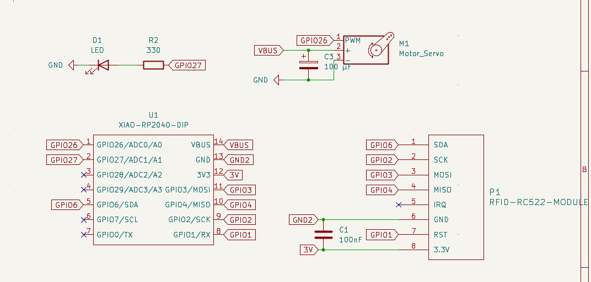
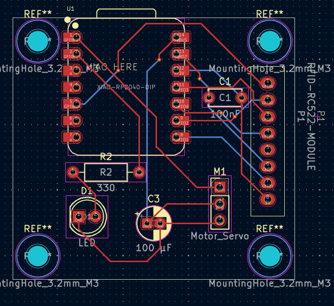
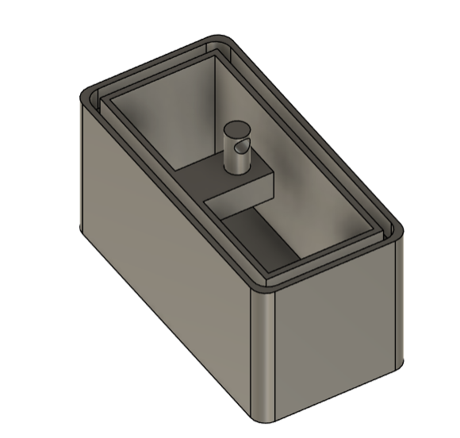
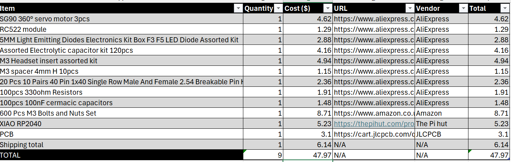

# NFC-lock-box

Description:

My project is a lock box that uses rfid/NFC technology to lock and unlock it. It also has an LED to show whether it is locked or unlocked. All you have to do is tap the accepted card and the servo moves to unlock it, remove the lid, take stuff out or put stuff in, close it and tap the card again and the servo will lock the box. I made this project so I could store my most delicate items, without the risk of other people breaking them, as it has happened multiple times before (not on purpose).

Struggles:

I had a few struggles while making this project, but I will only talk about the big one, as I don’t want to bore you. I found it very hard to find an effective way to lock and unlock the box effectively, so much so that I changed the mechanism multiple times. At first, I had it to where a servo arm would go in a hole with a wedge and would move to lock/unlock but realised it would be hard to track the circular motion inside that hole, so then I thought of doing a linear locking mechanism. I came up with many ideas, but decided to go with a rack and pinion, as I thought that would be the easiest to implement in the box. I found a template for a rack and pinion online and modified it, so it could fit into the design of my box.

BOM:

A more detailed BOM can be found in the BOM folder

* Xiao RP2040 module X1
* RC522 module set X1
* SG90 servo motor X1
* 3D printed box X1
* M3 Headset inserts X6
* M3 4mm spacer X8
* PCB X1
* LED X1
* 330ohm resistor X1
* 100nF ceramic capacitor X1
* 100microF electrolytic capacitor X1
* 2.54mm pin header X3
* M3 12mm screws X4
* M3 6mm screws X2

Images:

More images can be found in the images folder

.png)
.png)

